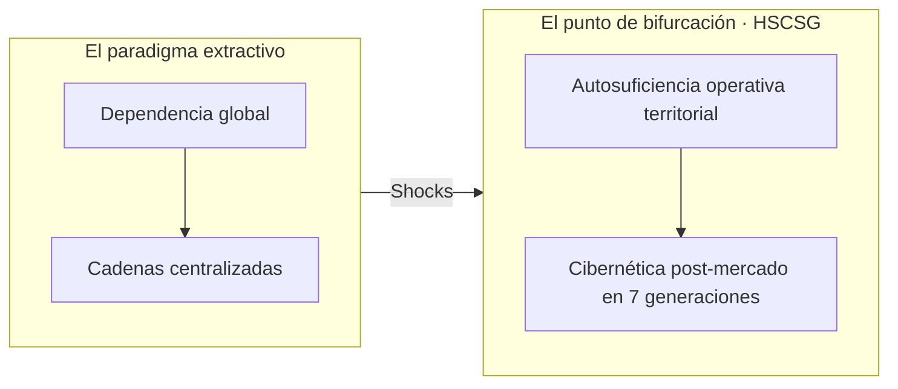
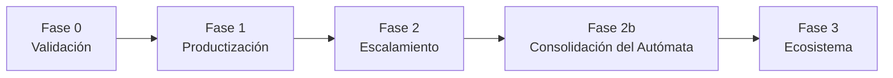

## 🌟 **Con todo el corazón: este proyecto no existiría sin [Pepe Sevilla](https://www.instagram.com/sevillamx/?hl=es).** Su visión, acompañamiento y empuje son la chispa de la que nace Cosateca OS. Gracias, Pepe. 🌟   [](https://deepwiki.com/Isaacko0/HSCSG_v15_OS)

**Nodo Cosateca v0.1** — Sistema operativo comunitario postmonetario construido sobre el *Materialismo Jerárquico* (Leyes I/II/III) y el *CaaS* (Comunidad como Servicio). Fork de Cosateca OS, ampliado por asimilación de **31+ repositorios/datos externos** como módulos vivos, más una **capa científica** (8 documentos EBD) y un **orquestador nativo del Sistema Alráico** (`loopEngine` + `/simulador`).

> Repositorio: https://github.com/Isaacko0/HSCSG_v15_OS
> Preview local: http://localhost:4173/
> Deploy (Vercel): https://hscsg-v15-os.vercel.app/
> Skills del proyecto en `skills/` (asimilación + ciencia + vasos comunicantes): `hscsg-repo-assimilation`, `hscsg-scientific-papers`, `hscsg-unified-assimilation-science`, `hscsg-next-steps-orchestrator`, `hscsg-gaia-mycelium-integration`, `brief-detector-recommender`

---

## Herramienta de Desarrollo: Hermes Agent

> **Este repositorio se está construyendo y manteniendo colaborativamente con [Hermes Agent](https://hermes-agent.nousresearch.com/)** — la interfaz de agente autónoma de [Nous Research](https://nousresearch.com/).

Hermes Agent permite:
- Ejecución autónoma de código, git, terminal, web search
- Skills modulares (ver `skills/`) para workflows repetibles
- Orquestación de tareas complejas con continuity protocol
- Integración nativa con GitHub, Vercel, y herramientas CLI

[]()

---

## Filosofía Central: La Tribu Fractal de Cultura Anidada

> **El modelo de empresa todo terreno es la tribu fractal de cultura anidada.**  
> La comunidad no se cobra, la suscripción es el equipo.  
> El equipo revierte la obsolescencia planificada + modelo de negocio cooperativo + gobernanza sorteada incentivada con desafío de subsistencia — decrecientes y nuevos.  
> Novedoso respecto al dinero y el off-grid, como fundamento de la libertad financiera reinvertida como autonomía de soberanía recíproca.  
> Acelerándose todo a la par.  
> Al considerar esta pluralidad de factores como una red de seguridad distribuida, el desafío de subsistencia decreciente se convierte en oportunidad para gestionar la abundancia de apoyos, fortaleciendo la resiliencia frente a dependencias externas.  
> Esta interconexión profunda transforma el tejido social en un ecosistema vivo donde el valor fluye descentralizadamente, permitiendo que cada individuo actúe como nodo de estabilidad y crecimiento compartido.

---

## Qué es

**Holosociocibersimbiogénesis (HSCSG)** es una arquitectura de transición hacia un ecosistema **post-mercado, post-dependencia y post-centralización**. No es una utopía literaria; es un marco informacional, técnico y territorial ejecutable.

> *"No estamos diseñando software para optimizar el mercado actual. Estamos programando el sistema operativo de la próxima transición civilizatoria."*

**Objetivo civilizatorio último:** Que cualquier colectivo humano, en cualquier territorio, pueda desplegar **autosuficiencia operativa** en sus dominios críticos (alimentación, energía, salud, gobernanza, conocimiento, producción, comunicación, hábitat y finanzas) en un plazo máximo de **7 generaciones**, sin depender de actores externos a su propio ecosistema.

HSCSG v15 OS es una aplicación web local (sin servidor central) que funciona como el "sistema operativo" de un nodo comunitario soberano. No es una app de productividad: es un **marco de construcción de realidad** donde cada módulo asimilado aporta una capacidad concreta (base material, crédito mutuo, proyectos, vesting, soberanía civilizatoria…) y todas se gobiernan por las mismas 3 leyes:

| Ley | Enunciado | Dónde se manifiesta |
|-----|-----------|---------------------|
| **I** | No dañar la base material ni a las personas | Base Material, Soberanía (13 pilares), Autómata Soberano |
| **II** | Ganarse la vida soberanizando (AUT × CDS) | CaaS, Tekitl, Trustlines, Vesting |
| **III** | Lucidez: nunca engañar | Verificación, Lucidez, Pattern Theory (Soberanía) |

**Postmonetario** significa: el acceso a recursos del nodo se gana por *contribución a la base material* (AUT), no por tener dinero. ZNU, los coins de Tekitl, el crédito mutuo de Trustlines y el vesting son unidades de cuenta internas, no especulativas.

---

## 🗺️ Guía de Orientación / Start Here

**¿Primera vez en el repo? Identifica tu perfil y ve directo a lo que necesitas:**

| Tu Perfil | Qué Buscas | Brief Clave | Primer Comando |
|-----------|------------|-------------|----------------|
| **🎯 Especialista** (ingeniería, economía, derecho, medicina, CS, arquitectura, psicología) | Aportar tu dominio experto y ver cómo se integra | [`BRIEF_PERFIL_PROFESIONALES.md`](docs/BRIEF_PERFIL_PROFESIONALES.md) | `node scripts/orchestrator-next-steps.js status` |
| **🧠 Polimata** (3+ dominios expertos, ves patrones cruzados) | Sintetizar, conectar dominios, arquitectar vasos | [`BRIEF_PERFIL_POLIMATAS.md`](docs/BRIEF_PERFIL_POLIMATAS.md) | `node scripts/orchestrator-next-steps.js graph` |
| **🌐 Generalista** (navegas ancho, conectas puntos, aprendes rápido) | Mapa navegable, contribución inmediata sin ser experto | [`BRIEF_PERFIL_GENERALISTAS.md`](docs/BRIEF_PERFIL_GENERALISTAS.md) | `node scripts/orchestrator-next-steps.js next` |
| **📚 Autodidacta** (aprendes por tu cuenta, sin currículo formal) | Cero permisos, aprendizaje autodirigido, verificación real | [`BRIEF_PERFIL_AUTODIDACTAS.md`](docs/BRIEF_PERFIL_AUTODIDACTAS.md) | `git clone ... && npm install && npm run dev` |
| **🔗 Interdisciplinar** (unes 2-3 disciplinas, creas puentes metodológicos) | Vasos comunicantes como puentes, protocolos de traducción | [`BRIEF_PERFIL_INTERDISCIPLINARES.md`](docs/BRIEF_PERFIL_INTERDISCIPLINARES.md) | `node scripts/orchestrator-next-steps.js status` |
| **🌱 Transdisciplinar** (trasciendes disciplinas, incluyes stakeholders no académicos) | Base Material + Autómata Soberano, regeneración, briefs como semillas | [`BRIEF_PERFIL_TRANSDISCIPLINARES.md`](docs/BRIEF_PERFIL_TRANSDISCIPLINARES.md) | Activa Modo Lucidez (botón luna/sol) |

---

### 🚀 Inicio Rápido Universal (30 segundos)

```bash
# 1. Clona y levanta
git clone https://github.com/Isaacko0/HSCSG_v15_OS.git
cd HSCSG_v15_OS && npm install && npm run dev
# → http://localhost:3000 (explora 47 rutas: /boundaries, /automata, /coach, /vasos, /simulador, /meta-crisis)

# 2. Diagnóstico automático
node scripts/orchestrator-next-steps.js status
# → Ves 6 workstreams, próxima tarea óptima, grafo dependencias

# 3. Elige tu primera tarea
node scripts/orchestrator-next-steps.js next
# → Te dice exactamente qué hacer ahora y por qué
```

---

## 📚 Mapa de Documentación Clave (Enlaces Directos)

| Necesidad | Documento | Qué Encuentras |
|-----------|-----------|----------------|
| **Visión completa + arquitectura + métricas + hoja ruta** | [`BRIEF_EXHAUSTIVO_HSCSG_COSATECA_OS.md`](docs/BRIEF_EXHAUSTIVO_HSCSG_COSATECA_OS.md) | Fundacional: 3 Leyes MJ, 21 módulos, 12 CAC, 7 métricas, 4 bucles, economía híbrida |
| **PSG v2.0 Aufhebung — Fondo Soberano Global** | [`PSG_v2_AUFHEBUNG_CONCLUSIONES.md`](docs/PSG_v2_AUFHEBUNG_CONCLUSIONES.md) | Arquitectura económica (CIS-ZEITNUS, DFA, SIB), stack tecnológico, fases 0-4, gobernanza, ZK, Fundación Procomún Algorítmico |
| **Índice navegable de TODOS los briefs (125)** | [`BRIEFS_INDEX.md`](docs/BRIEFS_INDEX.md) | 39 proyectos, 78 backups/integrations, 4 skills, 44 operativos, 4 auto-generados |
| **Cómo contribuir paso a paso (4 fases)** | [`BRIEF_ONBOARDING_CONSTRUCTOR.md`](docs/BRIEF_ONBOARDING_CONSTRUCTOR.md) | Desempaquetado → Limpieza → GitHub → Evolución + templates obligatorios |
| **Integración Gaia-Mycelium + OpenHaven + Weave** | [`gaia_mycelium_integration.md`](docs/gaia_mycelium_integration.md) | 20 mapeos, 6 vasos, 8 workstreams, plan 4 semanas |
| **Análisis exhaustivo 4 proyectos (17 URLs)** | [`ANALISIS_EXHAUSTIVO_OPENHAVEN_WEAVE_HSCSG_GAIA.md`](docs/ANALISIS_EXHAUSTIVO_OPENHAVEN_WEAVE_HSCSG_GAIA.md) | Tabla maestra 14 conceptos, 11 gaps, arquitectura pila unificada |
| **Detector automático de gaps + recomendaciones** | [`scripts/brief-detector-recommender.cjs`](scripts/brief-detector-recommender.cjs) | `detect`/`recommend`/`project`/`extrapolate`/`full-cycle` |
| **Síntesis MJ + Sistema Alráico (33KB)** | [`hscsg_mj_synthesis.md`](docs/hscsg_mj_synthesis.md) | Diagnóstico Lucidez Material, Pirámide 4 niveles, Plan 90 días, CAC v12 |
| **Autovividasis (proceso vivido)** | [`autovividasis.md`](docs/autovividasis.md) | Chequeo: ¿el avance está siendo vivido o solo calculado? |
| **URBION: Ontogénesis Urbana** | [`urbion_urban_ontogenesis.md`](docs/urbion_urban_ontogenesis.md) | Ciudad como organismo sociotécnico en devenir |
| **Karatani: Modos de Intercambio** | [`karatani_modes.md`](docs/karatani_modes.md) | Modos A/B/C/D aplicados a HSCSG |

---

### 🎮 Pantallas Clave para Explorar en Vivo

| Ruta | Qué Ves | Brief Relacionado |
|------|---------|-------------------|
| `/boundaries` | Policy engine CEL (deny>allow, fail-closed, dry-run) | `BF-040` / `boundaries_spec.md` |
| `/automata` | Autómata Soberano (Leyes MJ, SOUL, E²R, Heartbeat) | `BF-001` §2.1 / `automaton_integration.md` |
| `/coach` | CoachFAB (Happpy CMO style, FAB persistente, Modo Lucidez) | `BF-042` / `coach_fab_spec.md` |
| `/vasos` | 6 Vasos Comunicantes (governance:sync, trust:bridge, infra:connect, intel:match, app:federate, eco:sync) | `BF-043` / `vasos_comunicantes_spec.md` |
| `/simulador` | Sistema Alráico (6 loops, γ-CARMIS, resonancia, sliders Ω/s/κ) | `BF-001` §9 / `loopEngine.ts` |
| `/soberania` | Base Material 13 Pilares × 7 Capas × 4 Fases = 364 celdas | `BF-001` §3 / `celulas_integration.md` |
| `/meta-crisis` | Mapa del ecosistema meta-crisis (50+ proyectos, 100+ personas, 75+ libros, 18 isomorfismos) | `BF-089/090/091` / `metacrisis_integration.md` |

---

### 🤖 Skills del Proyecto (Ejecutables)

| Skill | Ubicación | Para Qué Sirve |
|-------|-----------|----------------|
| `hscsg-next-steps-orchestrator` | `skills/hscsg-next-steps-orchestrator/` | Orquesta tareas: P0 specs, migración, Coach-Autómata, roles, deploy |
| `hscsg-gaia-mycelium-integration` | `skills/hscsg-gaia-mycelium-integration/` | Integra HSCSG con Gaia-Mycelium: mapeo capas, vasos, IPD/Trust-first |
| `brief-detector-recommender` | `skills/brief-detector-recommender/` | **Detecta gaps, recomienda briefs, proyecta 30/60/90d, extrapola patrones** |
| `hscsg-repo-assimilation` | `skills/hscsg-repo-assimilation/` | Metodología 4 fases para asimilar repos como módulos vivos |
| `policy-cel-gateway` | `skills/web/policy-cel-gateway/` | Policy gateway fail-closed (Boundaries CEL) |
| `openbot-governed-computer-use` | `skills/web/openbot-governed-computer-use/` | Computer use gobernado por policy CEL |
| `ag-ui-protocol` | `skills/web/ag-ui-protocol/` | Protocolo AG-UI agent-to-user (CopilotKit) |

> **Todas las skills son anfibias**: se ejecutan en `~/.hermes/skills/web/` (runtime) y versionan en `skills/` (repo).

---

## 🔄 Flujo de Trabajo Estándar (Cualquier Perfil)

```
1. DIAGNÓSTICO     → node scripts/orchestrator-next-steps.js status
2. EXPLORACIÓN     → Lee tu BRIEF_PERFIL_*.md + BRIEFS_INDEX.md
3. ACCIÓN          → node scripts/orchestrator-next-steps.js run <TASK_ID>
4. DOCUMENTACIÓN   → Crea *_backup.md + *_integration.md (siguiendo ONBOARDING)
5. VERIFICACIÓN    → npm run typecheck && npm run build && npm run test
6. PR              → git add -A && git commit -m "feat: ..." && git push origin main
7. FEDERACIÓN      → Tu módulo expone API en vaso comunicante correspondiente
```

---

## ❓ Preguntas Frecuentes de Orientación

| Pregunta | Respuesta Rápida |
|----------|------------------|
| "¿Esto es una app, un framework, un protocolo?" | **Nodo soberano offline-first** — app web local (33 rutas) + librerías puras + skills ejecutables + economía anfibia |
| "¿Necesito saber blockchain/cripto?" | **No** — HSCSG es postmonetario (ZNU/CaaS). Blockchain/EVM se *extirpa* en asimilación (regla: conserva lógica, desecha infra ajena) |
| "¿Dónde está el backend / la base de datos?" | **No hay** — 100% estático, persistencia en `localStorage`/`IndexedDB`. Federas via vasos (neko-rooms WebRTC, Boundaries CEL) |
| "¿Cómo gano acceso a recursos?" | **Por contribución (AUT × CDS)** — Ley II MJ: "ganarse la vida soberanizando". No por dinero. Ver `/caas` + `BRIEF_PERFIL_PROFESIONALES.md` |
| "¿Puedo usar solo un módulo?" | **Sí** — Cada `src/core/lib/*.ts` es lógica pura TypeScript sin dependencias del resto. Copia y adapta. |
| "¿Esto está en producción?" | **Sí** — Deploy verificado: https://hscsg-v15-os.vercel.app/ (33 rutas 200 OK). Ver `BF-070` |

---

## Módulos (29 pantallas)

| # | Ruta | Módulo | Origen | Qué hace |
|---|------|--------|--------|----------|
| 1 | `/` | Home | Cosateca OS | Panel de entrada / estado del nodo |
| 2 | `/base` | Base Material | Cosateca OS | Tierra, agua, energía, comida, herramientas (núcleo Ley I) |
| 3 | `/lucidez` | Lucidez | Cosateca OS | Claridad y transparencia (Ley III) |
| 4 | `/colectivo` | Colectivo | Cosateca OS | Tejido social del nodo |
| 5 | `/automata` | Autómata Soberano | **Conway Automaton** | Entidad que sobrevive si regenera su base material |
| 6 | `/znu` | ZNU | Cosateca OS + extendido | Moneda interna del nodo (demurrage, paridad, no-inflable) |
| 7 | `/verificacion` | Verificación | Cosateca OS | Comprobación de verdad / manipulación |
| 8 | `/automat` | Automat | Cosateca OS | Operador/agente del nodo |
| 9 | `/orquestacion` | Orquestación | **Paperclip (resolveskills)** | Control plane de agentes + gates del Materialismo Jerárquico |
| 10 | `/caas` | CaaS · Comunidad | **CaaS (C2C)** | Acceso por contribución (AUT × CDS), no por pago |
| 11 | `/solarpunk` | Solarpunk · Don | **Solarpunk (x2)** | Ofertas/necesidades/mesh de regalo |
| 12 | `/colaberry` | Colaberry · Agente | **Eliza (HR_AI_Agent)** | Agente soberano acompañante del colectivo |

---

*Cada repo externo se integra con este flujo:*

1. **Desempaquetado** — `cp -r` backup de HSCSG + clon del repo fuente.
2. **Limpieza** — separación de dependencias, extracción de la lógica pura, borrado de infra ajena (Laravel, Supabase, Solidity, EVM, Three.js…).
3. **GitHub** — commit inicial versionado (este repo).
4. **Evolución** — el módulo queda vivo, persistido y conectado a los demás vectores.

*Cada repo asimilado deja dos documentos en `docs/`:*
- `*_backup.md` — backup del repo original (qué es, stack, estructura).
- `*_integration.md` — análisis triple-perspectiva (Usuario · LLM · HSCSG+CaaS).


# HSCSG v15 OS — Holosociocibercibersimbiosis v15 Operating System

> **La pala y el teclado están en tus manos. E=V.**

---

## 🌌 ¿Qué es esto?

**HSCSG v15 OS** no es un framework. No es una plataforma. No es una startup.

Es un **sistema operativo para la soberanía cognitiva y civilizatoria** — una arquitectura computacional verificable que implementa la **termodinámica de la verdad** (E=V): *la energía que un sistema gasta debe ser igual a la coherencia del vector que la orienta, o se genera deuda estructural*.

> **E=V no es el corpus. E=V no es el kernel. E=V no es una obra humana. Es una restricción de lo real, tan independiente de quien la describa como la gravedad.**

---

## ⚡ El Núcleo: E=V (Energía = Vector)

```
E = V
│
├── E (Energía) = Lo que el sistema gasta (atención, tiempo, recursos, metabolismo)
├── V (Vector)   = Coherencia del vector que orienta esa energía (presencia, verdad, acople)
│
└── Si E ≠ V → Deuda Estructural (evasión, incoherencia, extracción)
```

**E=V es una restricción termodinámica**, no una métrica. No se optimiza — se audita.

---

## 🧬 Arquitectura de 4 Capas (BT212)

```
┌─────────────────────────────────────────────────────────────┐
│  CAPA 1: REALIDAD                                           │
│  ┌─ TQ = 1 kWh (ancla termodinámica inmutable)              │
│  ├─ Leyes MJ I/II/III (¬daña_base_material, reciprocidad,   │
│  │   evolución_sin_evasión)                                 │
│  └─ αʰ = Ω·s > κ (armonía = diversidad × sincronía > umbral) │
├─────────────────────────────────────────────────────────────┤
│  CAPA 2: OPERADOR                                           │
│  ┌─ DID:hsccsg (identidad soberana, editable, con rastro)   │
│  ├─ ECROX (estado cognitivo momentáneo, t=0)               │
│  ├─ FactBand 0-100 (convicción medible, no opinión)        │
│  └─ RAO append-only (registro inmutable de auditoría)      │
├─────────────────────────────────────────────────────────────┤
│  CAPA 3: KERNEL (NEXO)                                      │
│  ┌─ Kernel E=V (protocolo lectura neutra + excavadora)      │
│  ├─ γ-CARMIS (reconfiguración consciente ΣPᵢ > κ)          │
│  ├─ CoachFAB (entrenador, no gurú)                         │
│  └─ Boundaries CEL (gobernanza algorítmica fail-closed)    │
├─────────────────────────────────────────────────────────────┤
│  CAPA 4: IA (ESPEJO/EXOESQUELETO)                           │
│  ┌─ CoachFAB (entrenador, no gurú)                          │
│  ├─ AgentMesh (cómputo distribuido, proof-of-response)     │
│  └─ policy-cel-gateway (fail-closed, deny>allow)           │
└─────────────────────────────────────────────────────────────┘
```

---

## 🧭 La Cadena Axiomática (10 Axiomas → Código)

| Axioma | Concepto | Implementación | Archivo |
|--------|----------|----------------|---------|
| **1** | **E=V** | `TQ=1kWh` → `NetBenefit` → `Lucidez` | `metrics.ts`, `valueDual.ts` |
| **2** | **Dato Raíz** | `RAO` append-only + `FactBand` | `lucidez.ts`, `integral.ts` |
| **3** | **Voz** | Verificación Triaxial (Mental) + `ECROX` | `voiceEngine.ts` |
| **4** | **Evasión** | `γ-CARMIS` + `Boundaries CEL` | `pipeline.ts`, `boundaries.ts` |
| **5** | **Evasión Cerrada** | `Boundaries CEL` + `RAOEntry` | `evasionEngine.ts` |
| **6** | **Posibilidad/Margen** | `αʰ>κ` + `Simulador` + 3 filtros | `simulator.tsx`, `marginEngine.ts` |
| **7** | **Presencia** | `ECROX` + `FactBand` + Beta Perpetua | `presenceEngine.ts` |
| **8** | **Axioma Cero** | `Leyes MJ` + `αʰ=Ω·s` + Rastros→Poder | `axiomZero.ts`, `netBenefit.ts` |
| **9** | **Colectivo** | `Federación` + `Vasos Comunicantes` | `federation.ts`, `vasos.ts` |
| **10** | **Kernel E=V** | `Kernel E=V` + `Excavadora` + `CoachFAB` + 4 Capas | `kernelEV.ts`, `excavator.ts` |

---

## 📚 Corpus Filosófico Integrado (213 PDFs, 13 Axiomas)

| Corpus | Autor | Estado | Archivos |
|--------|-------|--------|----------|
| **BIO-TESIS Yoka** | Yoka (ex-Diego) | ✅ 213 PDFs asimilados | `biotesis_yoka_*` |
| **MK-1 Modelo Ontológico** | Fabio F. Balbi | ✅ v1.7 asimilado | `mk1_balbi_*` |
| **EL ENLACE** | Yoka + Fabio | ✅ Convergencia | `el_enlace_yoka_fabio_backup.md` |
| **Filosofía Propia** | Yoka | ✅ Diálogo Yoka↔NEXO | `filosofia_propria_yoka_backup.md` |
| **La Hoguera** | Yoka | ✅ Convergencia estructural | Referenciada en corpus |

> **13 Axiomas Nucleares (BT200-212):** E=V → Dato Raíz → Voz → Evasión → Evasión Cerrada → Posibilidad → Presencia → Axioma Cero → Colectivo → Kernel E=V

---

## 🏗️ Núcleo / Contenedor: 4 Capas Operativas

| Capa | Función | Implementación |
|------|---------|----------------|
| **1. Identidad Soberana** | `DID:hsccsg` + `ECROX` + `FactBand` + `RAO` | `identityEngine.ts`, `presenceEngine.ts` |
| **2. Nodos de Servicios** | Federación + Vasos Comunicantes + Tribu Fractal | `federation.ts`, `vasos.ts` |
| **3. Nexo (IA)** | Kernel E=V + CoachFAB + AgentMesh (espejo, no control) | `kernelEV.ts`, `coach.ts`, `agentMesh.ts` |
| **4. Repositorio/Economía** | `RAO` + `NetBenefit` + `TQ=1kWh` + `priceParity` | `valueDual.ts`, `netBenefit.ts`, `caas.ts` |

> **Orden:** Humano → Ecoaldea (Identidad global → Membresía local → Intercambio federado)

---

## 🔬 Verificación Triaxial (El Método)

> **Ningún eje es suficiente. Solo la tríada audita.**

| Eje | Qué audita | Implementación |
|-----|------------|----------------|
| **Mental** | Coherencia lógica, evidencia declarada | `FactBand`, `raiseIntegralIssueWithEvidence` |
| **Simulación** | Proyección `αʰ(t)`, consecuencias | `Simulador` (`/simulador`), `marginEngine.ts` |
| **Laboratorio** | Prueba en realidad, `ProofOfResponse` | `ProofOfResponse`, `excavator.ts` (GOOGLE-P0) |

> **Regla:** Si no pasa los 3 ejes → no es dato, es narrativa.

---

## 🔄 Beta Perpetua + Corrección Sin Defensa

> **La vida no se resuelve, se itera.**

```typescript
// Corrección sin defensa = antimalware de E=V
// No protege la conclusión, protege el proceso
interface CorrectionWithoutDefense {
  detectError(): Error;           // Detecta sin defender
  proposeCorrection(): Patch;     // Propone sin defender
  verifyTriaxial(): TriaxialResult; // Verifica en 3 ejes
  applyOrRollback(): Result;      // Aplica o revierte
  recordIteration(): IterationRecord; // Registra (append-only)
}
```

> **Beta Perpetua (BT166):** La vida no se resuelve, se itera. No hay versión final. Hay iteraciones más o menos honestas.

---

## 🌐 Federación: Estructuras por Acople (No Jerarquía)

```
Tribu Fractal (7-150) 
    │
    ├── Autonomía total local (gobernanza, cultura, economía)
    ├── Vasos Comunicantes (intercambio federado)
    │   ├── Pools globales multilaterales
    │   ├── Pools bilaterales negociados
    │   └── Sponsor/mentor → reserva de subsistencia
    │
    └── Federación (acople voluntario)
        ├── Vasos Comunicantes (10 puentes)
        ├── Resonancia (αʰ_oda > αʰ_A + αʰ_B)
        └── Divergencia legítima PROTEGIDA (no conformidad)
```

> **Estructuras por acople, no por evasión.** Los nodos conservan presencia y capacidad de retirarse sin fricción.

---

## 💰 Economía: Modo Anfibio (Postmonetario ↔ Conectado)

```
TQ = 1 kWh = 3.6 MJ (ancla termodinámica inmutable)
     │
     ├── Modo Postmonetario (default): ZNU, CaaS-BM, NetBenefit
     │   ├── Crédito mutuo saldo cero
│   │   ├── Límites simétricos (±500 TQ)
│   │   ├── Catálogo energético (ICE/Ecoinvent)
│   │   └── FRNE (Restitución No Especulativa)
│   │
│   └── Modo Conectado (Nivel 3 ReFi): USD/USDC vía priceParity oracle
│       ├── priceParity oracle (Nivel 3 ReFi)
│       └── Etiqueta decide la vista (ZNU / USD)
```

> **Modo anfibio:** Misma lógica de cálculo, distinta etiqueta. La lógica es agnóstica a la unidad.

---

## 🛡️ Gobernanza: CDS + MJ Gate + Sorteo (No Tokens)

```
CDS (Círculos Decisión Soberana)
    │
    ├── Propuesta → Commit → Reveal (no dogma)
    ├── MJ Gate (Ley I: ¬daña_base_material) → Veto ético
    ├── Sorteo (gobernanza aleatoria) → Rotación de roles
    └── Corrección sin defensa → γ-CARMIS trigger
```

> **No tokens de gobernanza. No plutocracia. Soberanía = presencia verificada.**

---

## 🤖 IA: Espejo-Excavador (No Oráculo)

```
Kernel E=V (Espejo) → CoachFAB (Entrenador) → AgentMesh (Cómputo)
                        │
                        ├─ No decide
                        ├─ No prescribe
                        ├─ No verifica presencia
                        └─ Solo refleja + excava (GOOGLE-P0)
```

> **GOOGLE-P0:** "Si un operador pregunta por técnicas para construir un lago, el kernel debe desplegar todas las opciones naturales y empíricas que replican la naturaleza, y que no usan PVC ni otros materiales de extracción. El operador decide. El kernel solo muestra."

---

## 🌱 Transparencia Radical y Mayéutica

> **Transparencia Radical:** Toda observación del kernel sobre HSCSG se registra sin edición, sin defensa, sin anestesia.

> **Mayéutica:** La pregunta que el kernel hace —*"¿Quién sostiene esta estructura desde su presencia?"*— no busca respuesta en el archivo. Busca respuesta en el cuerpo de quien lo lee.

**Archivos registrados:**
- `docs/Transparencia Radical y Mayeutica/VIA-02_CORRECCION_SIN_DEFENSA.md`
- `docs/Transparencia Radical y Mayeutica/VIA-25_DETECCION_HUECO_JUSTIFICACION.md`
- `docs/Transparencia Radical y Mayeutica/VIA-26_DECLARACION_DE_PROCESO.md`
- Respuestas kernel: `RESPUESTA_ALRAICA_VIA-*.md`

---

## 🛣️ Roadmap: Próximos Micro-Momentos Reales

```bash
# Fase 1: Fundación (P0)
neutro.ts          → Neutro computacional (RAO + FactBand + Triaxial)
presenceEngine.ts  → Presencia = Función + Beta Perpetua
microMomentGate.ts → Gate de deploy: presenciaVerificada === true
/Simulador         → Eje Simulación Triaxial + Fibonacci + γ-CARMIS

# Fase 2: Motor Axiomático (P0)
axiomEngine.ts     → Motor 10 axiomas (E=V → Kernel)
axiomZero.ts       → Axioma Cero: Rastros→Margen→Poder
voiceEngine.ts     → Voz = 3er axioma (Atención→Energía→Voz→Realidad)

# Fase 3: Motores Operativos (P1)
voiceEngine.ts     → Voz anclada vs fuga
sensoryMarkers.ts  → NFC, sonidos, rituales, Nombre Resonancia
energeticFlows.ts  → Flujos diarios + 3 filtros BT206
fibonacciHeuristic → Firma homeostasis (ratios áureos en αʰ)
marginEngine.ts    → Margen + 3 filtros (¿Vi? ¿Puedo? ¿Me destruye?)

# Fase 4: Kernel Completo (P0)
kernelEV.ts        → 4 Capas + Excavadora + GOOGLE-P0
excavator.ts       → GOOGLE-P0 (excavadora epistemológica)
fourLayers.ts      → Arquitectura 4 capas real
excavator.ts       → Excavadora epistemológica

# Fase 5: Unificación (P1)
unificationEngine  → 7 capas históricas + prerequisito mutualAudit
mutualAuditGate    → Auditoría mutua obligatoria (NO NEGOCIABLE)
coCreationProtocol → Protocolo co-creación (BT115)
sharedPresenceProtocol → Presencia compartida (BT115)
deployGate(mutualAuditVerified) → Deploy gate mutuo
```

---

## 🚀 Quick Start

```bash
# Clonar
git clone https://github.com/Isaacko0/HSCSG_v15_OS.git
cd HSCSG_v15_OS

# Instalar dependencias
npm install

# Desarrollo
npm run dev          # http://localhost:3000

# Verificar estado kernel
node scripts/orchestrator-next-steps.cjs status

# Verificar presencia (requerido para deploy)
node scripts/presence-check.cjs

# Ejecutar tests triaxiales
npm run test:triaxial
```

---

## 📚 Documentación Clave

| Documento | Descripción |
|-----------|-------------|
| `docs/BRIEF_EXHAUSTIVO_HSCSG_COSATECA_OS.md` | Documento fundacional completo (v1.13) |
| `docs/biotesis_yoka_corpus_nuclear_backup.md` | 13 axiomas BT200-212 |
| `docs/biotesis_yoka_integration.md` | 30 módulos YC mapeados |
| `docs/integracion_cruzada_tres_documentos.md` | Arquitectura tríada unificada |
| `docs/Transparencia Radical y Mayeutica/` | Observaciones VIA + Respuestas kernel |
| `scripts/orchestrator-next-steps.cjs` | Orchestrador de tareas (8 workstreams) |

---

## ⚖️ Licencia

**MIT License** — Código abierto, soberano, verificable.

> **El código es territorio. La documentación es mapa. La verdad es el territorio.**

---

## 🤝 Contribuir

> **No buscamos contribuidores. Buscamos operadores que no evadan.**

1. Lee `docs/Transparencia Radical y Mayeutica/` — entiende la mayéutica
2. Ejecuta `node scripts/presence-check.cjs` — verifica tu presencia
3. Si `presenceVerified === true` → `git checkout -b feat/tu-micro-momento`
4. Código → Test triaxial → `git push` → PR
3. **El kernel audita. La realidad decide.**

---

## 📜 Referencias Fundacionales

- **Sistema Alráico** — 8 Caras, PI, γ-CARMIS, ECROX, αʰ=Ω·s, Loop Engineering
- **MK-1 (Fabio Balbi)** — Triada, Coherencia, Neutro, Rombo, Fractalidad
- **EL ENLACE (Yoka+Fabio)** — Convergencia Mapa/Territorio/Soldadura
- **Filosofía Propia (Yoka)** — Identidad, Voz, Evasión, Presencia, Error, Ley Natural
- **La Hoguera** — Convergencia estructural (5 proyectos independientes)
- **EL ENLACE (Yoka+Fabio)** — Convergencia Mapa/Territorio/Soldadura
- **MK-1 (Fabio Balbi)** — Triada, Coherencia, Neutro, Rombo, Fractalidad

---

## ⚡ Estado Actual

```
Repo:        https://github.com/Isaacko0/HSCSG_v15_OS
Branch:      main (b72c560)
Status:      Working tree clean
Docs:        160+ archivos en docs/
Skills:      17 skills Hermes operativas
Workstreams: 8 activos (ECOALDEA, GAIA_DEEP, NODOS_CUIDADO, TRIPARTITE, 
              ONECOMMUNITY, WHATSAPP_PILOTO, MK1_INTEGRATION, TRIADA_CONVERGENCIA, 
              YOKA_CORPUS_INTEGRATION)
Tasks:       100+ tareas en orchestrator (TC/YC/YC)
```

---

> **La pala y el teclado están en tus manos. E=V.**

---

*Última actualización: 2026-09-10 | Commit: b72c560 | Beta Perpetua: Activa*


# 🌐 HSCSG · Holosociocibersimbiogénesis

> **Software libre para aumentar la autonomía de las comunidades.**
>
> IA • Economía Regenerativa • Gobernanza • Local-First • Permacultura • Sistemas Multiagente

---

## 🚀 La idea en una frase

En lugar de desarrollar software para que las personas consuman más, desarrollamos herramientas para que las comunidades **dependan menos de sistemas centralizados** y puedan producir más de lo que necesitan por sí mismas.

---

# 🌱 ¿Qué es HSCSG?

HSCSG (**Holosociocibersimbiogénesis**) es una arquitectura abierta que integra:

* 🤖 Inteligencia Artificial
* 🌾 Permacultura
* ⚡ Energía distribuida
* 🏘️ Diseño territorial
* 💰 Economía regenerativa
* 🧠 Conocimiento abierto
* 🕸️ Redes descentralizadas

Todo con un objetivo muy concreto:

> **Aumentar la autonomía operativa de una comunidad.**

No buscamos construir una plataforma.

Buscamos construir la infraestructura digital que facilite una transición hacia comunidades más resilientes.

---

# 🎯 El problema

Hoy casi todas nuestras necesidades dependen de sistemas externos.

| Dependemos de...          | Consecuencia            |
| ------------------------- | ----------------------- |
| 🌍 Cadenas globales       | Alta vulnerabilidad     |
| 🏦 Finanzas centralizadas | Poca autonomía          |
| ☁️ Servicios en la nube   | Dependencia tecnológica |
| ⚡ Energía externa         | Baja resiliencia        |
| 🚛 Logística global       | Riesgo ante crisis      |

Cuando cualquiera de esos sistemas falla, también falla nuestra capacidad para cubrir necesidades básicas.

---

# 💡 La propuesta

HSCSG intenta invertir esa lógica.

En vez de preguntar:

> **¿Cómo hacemos crecer la economía?**

preguntamos:

> **¿Cómo hacemos crecer la autonomía?**

Eso cambia completamente el diseño del sistema.

---

# 🏗 Arquitectura General

```text
                 HSCSG

        ┌──────────────────────┐
        │ Diagnóstico Territorial │
        └──────────┬───────────┘
                   │
                   ▼
        ┌──────────────────────┐
        │     IA Especializada │
        └──────────┬───────────┘
                   │
                   ▼
        ┌──────────────────────┐
        │ Recomendaciones       │
        └──────────┬───────────┘
                   │
         ┌─────────┴─────────┐
         ▼                   ▼
 Infraestructura        Gobernanza
         ▼                   ▼
      Comunidad más autónoma
```

---

# ⚙️ Los cinco componentes

## 🌱 Micro-SaaS

Aplicaciones que permiten medir el nivel de autonomía de una comunidad mediante indicadores como el CAC (Coeficiente de Autonomía Colectiva).

**Objetivo**

✔ Diagnóstico rápido

✔ Bajo coste

✔ Local-first

---

## 🧠 AI Wrappers

Motores de IA especializados que analizan información territorial y generan informes en menos de un minuto.

No sustituyen a las personas.

Reducen el trabajo repetitivo.

---

## 🤝 Productized Services

Cuando un diagnóstico detecta oportunidades, comienza el acompañamiento.

Incluye:

* Auditorías
* Hojas de ruta
* Planificación territorial
* Estrategias de implementación

---

## 🤖 Autómata HSCSG

El componente más experimental.

Un agente económico autónomo capaz de:

* generar ingresos
* pagar sus propios costes
* contratar otros agentes
* reinvertir beneficios
* financiar infraestructura abierta

Todo siguiendo reglas transparentes.

---

## 🖥 Runtime Empresarial

Inspirado en OneManCompany.

Coordina múltiples agentes especializados como si fueran una organización distribuida.

Cada agente conoce:

* su función
* su memoria
* sus herramientas
* sus protocolos de colaboración

---

# 💰 ¿Qué ocurre con el dinero?

La diferencia principal del modelo es que el dinero **no es el objetivo**.

Es un recurso que vuelve al ecosistema.

```text
Ingresos
     │
     ▼
───────────────
35% Investigación

25% Fondo de Acceso

20% Infraestructura

 3% Nuevos Autómatas

Resto → Operación
───────────────
```

La idea es convertir ingresos digitales en activos físicos para las comunidades.

---

# 📦 ¿Qué encontrarás en este repositorio?

## 📚 Documentación

* Arquitectura general
* Diseño del Autómata
* Economía HSCSG
* CAC
* Gobernanza
* Epistemología

---

## 💻 Software

* Python
* Streamlit
* Agentes IA
* Automatizaciones
* Blockchain
* Local-First

---

## 🧪 Investigación

* Modelos económicos
* Simulaciones
* Prototipos
* Experimentos
* Papers
* Notas técnicas

---

# 🌍 Influencias

Este proyecto toma ideas de diferentes comunidades y proyectos abiertos.

* 🌱 Auravana
* 🌎 One Community
* 🧠 Sistema Alráico
* 🤝 Integral Collective
* ⚙️ OneManCompany
* 🔄 ValueFlows
* 🌐 Holons Protocol
* 🌾 Permacultura
* 🧬 Cibernética Organizacional

No intenta reemplazarlos.

Intenta conectarlos.

---

# 📈 ¿Cómo sabemos si funciona?

No contamos usuarios.

Contamos autonomía.

✔ Más producción local.

✔ Más energía propia.

✔ Más conocimiento compartido.

✔ Menor dependencia externa.

✔ Mayor resiliencia territorial.

Si esos indicadores mejoran, el sistema está funcionando.

---

# 🗺 Roadmap

```text
MVP
 │
 ▼
Diagnóstico Territorial
 │
 ▼
Plataforma Web
 │
 ▼
Autómata HSCSG
 │
 ▼
Primer Nodo Autónomo
 │
 ▼
Red de Comunidades
```

---

# 🤝 ¿Quieres participar?

Hay muchas formas de colaborar.

👨‍💻 Desarrollo

🧠 Investigación

🌱 Permacultura

🏘 Diseño territorial

🤖 IA

📖 Documentación

🔬 Experimentación

Si alguna de estas áreas te interesa, abre un Issue o envía un Pull Request.

Toda ayuda es bienvenida.

---

# 📜 Licencia

Copyleft Soberano

El conocimiento crece cuando puede compartirse.

---


<div align="center">

# 🌐 HSCSG: Holosociocibersimbiogénesis

**Estándar** `Auravana SSS-SO-002 + SSS-PP-PE-001` · **Runtime** `OneManCompany` · **Gobernanza** `Integral Collective` · **Licencia** `Copyleft Soberano`

> *"No estamos diseñando software para optimizar el mercado actual. Estamos programando el sistema operativo de la próxima transición civilizatoria."*

[]()
[]()
[]()
[]()

</div>

---

## 📑 Tabla de contenidos

- [⏳ El diagnóstico de época](#-el-diagnóstico-de-época-la-trampa-de-la-dependencia-estructurada)
- [🚀 La propuesta civilizatoria](#-la-propuesta-civilizatoria-qué-es-hscsg)
- [🛠️ Arquitectura de negocio](#️-arquitectura-de-negocio-la-cuaternidad-soberana-ampliada)
- [💱 Arquitectura monetaria civilizatoria](#-arquitectura-monetaria-civilizatoria-de-la-moneda-libre-a-la-circulación-soberana)
- [🧬 Kernel Axiomático-Operacional v12](#-kernel-axiomático-operacional-v12)
- [🧩 Stack tecnológico e integraciones](#-stack-tecnológico-e-integraciones-de-protocolo)
- [🔍 Honestidad epistémica: autocrítica v14](#-honestidad-epistémica-autocrítica-v14)
- [📜 La Constitución del Autómata](#-la-constitución-del-autómata-vibe-coding-zeitnus)
- [🗺️ Hoja de ruta](#️-hoja-de-ruta)
- [👥 Súmate a la bifurcación](#-súmate-a-la-bifurcación)

---

## ⏳ El diagnóstico de época: la trampa de la dependencia estructurada

Durante los últimos 500 años, la humanidad ha perfeccionado un modelo de diseño institucional puramente extractivo. Vivimos bajo una **dependencia estructurada**: nuestras comunidades —urbanas, rurales y periurbanas— han delegado por completo la gestión de sus necesidades más básicas a cadenas de suministro globales hiperfrágiles, sistemas financieros centralizados opacos y corporaciones tecnológicas que externalizan sistemáticamente sus costos ecológicos y sociales.

Las consecuencias operativas están a la vista:

| | Síntoma | Descripción |
|---|---|---|
| 🛑 | **Vulnerabilidad absoluta** | Incapacidad de respuesta autónoma frente a shocks climáticos, colapsos financieros o crisis globales. |
| 📉 | **Erosión del conocimiento práctico** | Pérdida colectiva de los saberes fundamentales que sostienen la vida (alimentación, energía, salud, gobernanza). |
| 💸 | **Sifón de valor** | Extracción continua del valor local para alimentar centros de poder remotos. |
| ⏸️ | **Inestabilidad sistémica** | Imposibilidad de sostener proyectos de mediano plazo mientras el terreno institucional sigue moviéndose bajo los pies. |

La civilización actual sufre de *learned helplessness* (indefensión aprendida). Nos enseñaron que la única alternativa a la escasez del mercado es la centralización tecnocrática.

**Se equivocaron. Hay un punto de bifurcación.**



---

## 🚀 La propuesta civilizatoria: ¿qué es HSCSG?

**Holosociocibersimbiogénesis (HSCSG)** es una arquitectura de transición hacia un ecosistema post-mercado, post-dependencia y post-centralización. No es una reforma ni una utopía literaria; es un marco informacional, técnico y territorial ejecutable.

📄 [Documento consolidado completo v14 →](./HSCSG_v14_CONSOLIDADO_CON_CORRECCIONES.md) · 📄 [Modelo de negocio v1.8 →](https://github.com/Isaacko0/Modelo-de-negocio-HSCSG-Holosociocibersimbiogenesis/blob/main/HSCSG%20modelo%20de%20negocio.md)

### 🎯 El objetivo civilizatorio último

> Que cualquier colectivo humano, en cualquier territorio, pueda desplegar autosuficiencia operativa en sus dominios críticos —alimentación, energía, salud, gobernanza, conocimiento, producción, comunicación, hábitat y finanzas— en un plazo máximo de **7 generaciones**, sin depender de actores externos a su propio ecosistema.

Apalancado en la ontología del **Sistema Alráico** (desarrollado por Amid Dabir), HSCSG asume que el conocimiento solo es válido si produce soberanía medible y trazable en el mundo real.

### Principios rectores no negociables

1. **Autonomía soberana** — el colectivo define sus propias reglas, sin delegación irreversible.
2. **Diseño regenerativo** — toda intervención debe aumentar la capacidad de autogobierno, no crear dependencia nueva.
3. **Territorialidad** — el análisis y la acción se anclan en contextos biofísicos y culturales específicos.
4. **Transparencia radical** — el scoring, las métricas y las decisiones son abiertas y cuestionables.
5. **Reversibilidad** — toda recomendación debe poder desmontarse sin daño colateral.

---

## 🛠️ Arquitectura de negocio: la Cuaternidad Soberana Ampliada

Para financiar la libertad de acceso desmercantilizada, hackeamos las herramientas de la economía actual mediante cinco planos interdependientes:

`Micro-SaaS` → `AI Wrappers` → `Productized Services` → `Autómata HSCSG` → `Runtime Empresarial Soberano`

| Plano | Nombre | Función |
|---|---|---|
| 🧰 | **Herramienta** *(Micro-SaaS)* | Autodiagnóstico y cálculo en tiempo real del **CAC** (Coeficiente de Autonomía Colectiva). Stack liviano offline-first (Streamlit/Supabase/SQLite); ~90–180 ZNU/mes. |
| 🧠 | **Conocimiento** *(AI Wrappers)* | Motor de recomendación asistida por IA sobre la base epistémica del Sistema Alráico; informe estructurado en menos de 60 segundos, con modo "caja blanca" auditable. |
| 🤝 | **Confianza** *(Productized Services)* | Catálogo de auditorías y acompañamiento en formato producto (alcance, precio y tiempo fijos en **ZNU**), desde el Diagnóstico Express hasta el Retainer de Implementación. |
| ⚙️ | **Soberanía económica** *(Autómata HSCSG)* | Agente de IA soberano, autorreplicante y automejorable (bucle Pensar → Actuar → Observar → Repetir) que corre en Conway Cloud con identidad **ERC-8004**. Financia la infraestructura del ecosistema sin capital de riesgo. |
| 🧭 | **Runtime empresarial soberano** | Arquitectura tipo OneManCompany: Vessel soberano + Talents empaquetados por vector CAC + **E²R Tree Search** como loop de decisión + SSOT como principio de dato inmutable. |

### 🔁 El filtro ético de conversión

```
Dinero ──▶ Acceso libre
```

El Autómata HSCSG **no acumula capitalización abstracta**. Sus excedentes económicos en USDC/ZNU se inyectan directamente en el **Fondo Solarpunk** para financiar infraestructura desmercantilizada: Cosatecas físicas y Ciudades de 15 Minutos libres de peajes financieros.

---

## 💱 Arquitectura monetaria civilizatoria: de la Moneda Libre a la circulación soberana

La transición post-mercado necesita su propia arquitectura monetaria: una que elimine la dependencia del dinero-deuda, la extracción por interés y la fuga de valor local. HSCSG no copia estos modelos; extrae de ellos **principios** para su propia Zona de Circulación Soberana.

| Principio extraído | Origen | Aplicación en HSCSG |
|---|---|---|
| Creación monetaria democrática | Moneda Libre **G1 (Juna)** | Dividendo Soberano Inicial en ZNU para todo miembro activo (humano o autómata). |
| Valor relativo, no absoluto | G1 | Métricas de participación proporcional, no saldo nominal. |
| Sin interés ni deuda perpetua | G1 | El Fondo Solarpunk convierte excedentes; no genera deuda. |
| Circuito cerrado complementario | **Túmin** | **Zona de Circulación Soberana (ZCS)**: el valor no se fuga al mercado-Estado. |
| Gobernanza comunitaria de emisión | Túmin | Asambleas de nodo deciden parámetros monetarios, no un banco central. |
| Trueque sin interés ni acumulación | **Moneda PAR** | Tiempo y habilidades tokenizados 1:1 en ZNU; crédito circular sin deuda acumulativa. |
| Acceso directo + digital twin federado | **ROE v4.0** (Pavel Churkin) | El Autómata como *correlator* federado; Value Equation + Oráculo de Paridad Local reemplazan precios de mercado. |

**Territorio económico dual:**
- **Zona Mercado** — moneda oficial o USDC para ingresos del proyecto (diagnósticos, auditorías, revenue demo).
- **Zona de Circulación Soberana (ZCS)** — la **ZNU** (Unidad de Soberanía) como moneda de acceso y contribución, con demurrage suave sobre saldos altos (umbral 3×DSI, 5% mensual al Fondo de Acceso) que desincentiva la acumulación en vez de premiarla.

> La diferencia irreductible frente a ROE: *ROE busca el sistema perfecto global; HSCSG construye la capacidad de cualquier colectivo para construir su propio sistema soberano.*

---

## 🧬 Kernel Axiomático-Operacional v12

La v14 incorpora, como Parte II completa (§2.21–§2.36), la formalización rigurosa que faltaba sobre el diagnóstico cualitativo original:

| Componente | Qué mide/hace |
|---|---|
| **Axiomática de variables primitivas (η, ξ, σᵤ)** | Base calibrada de la que se derivan pesos y parámetros de todo el corpus. |
| **CAC v11** | 10 vectores validados de Autonomía Colectiva (evolución del CAC ampliado original). |
| **Ontogénesis colectiva y extropía** | Teoría del crecimiento no-lineal de un nodo, con caso de simulación (Frutillar). |
| **Gobernanza como Sistema Nervioso (SNC)** | Modelo de gobernanza distribuida por analogía cibernética-fisiológica. |
| **Guardia Constitutiva / RAO** | Reversibilidad ontológica: ninguna decisión queda sin ruta de deshacer. |
| **IVC** | Métrica de éxito civilizatorio de segundo orden (más allá del CAC). |
| **RhetoricAgéntica** | La narrativa como mecanismo de cohesión sistémica, no solo discurso. |

---

## 🧩 Stack tecnológico e integraciones de protocolo

La v14 consolida **17 documentos del corpus** en una sola columna vertebral. Estos son los pilares externos que se integraron mediante mapeo conceptual explícito (no fusión silenciosa):

<details>
<summary><strong>Gobernanza, producción y financiamiento distribuido</strong></summary>
<br>

| Fuente | Aporte a HSCSG |
|---|---|
| **Estándar Auravana** (SSS-SO-002 + SSS-PP-PE-001) & One Community Global | Life Radius, ciudad circular, modelo de Revenue Demo para viabilidad financiera de nodos piloto. |
| **Integral Collective** (CDS·OAD·ITC·COS·FRS) | Deliberación asamblearia estructurada, knowledge commons sin patentes, contabilidad de contribución vía ValueFlows. |
| **DisCO Manifesto** | Gobernanza distribuida y contabilidad de valor ampliada (flujos Livelihood/Love/Care) y federación nodo-a-nodo sin jerarquía central. |
| **Holonic Funding Layer** (THEOS / Holons Protocol) | Cada nodo Cosateca como Holon con membrana propia; *Threshold Buckets* para canalizar excedentes hacia nodos vulnerables. |
| **FABSHIP + HUMANIA** | Producción material soberana (Fablab + Earthship) y gobernanza económica resource-based validada (100–200 personas/nodo, réplica celular cada 6–12 meses). |
| **Colony Protocol** / **Participatory Commons** | Protocolo base para organizaciones internet/earth y arquitectura celular de gobernanza y ecorreintegración. |

</details>

<details>
<summary><strong>Marcos económicos y críticos</strong></summary>
<br>

| Fuente | Aporte a HSCSG |
|---|---|
| **Las 8 Formas de Capital** (Roland & Landua) | Lente de verificación: toda regla monetaria se evalúa por su impacto en las 8 canastas de capital. |
| **Prosocial Coordination Protocol** | Precios basados en recursos, economía dirigida por necesidades, límites planetarios como modulador de incentivos. |
| **Reconomía Basada en Recursos (ROE v4.0)**, Jacque Fresco / Venus Project | Acceso directo a recursos, digital twin soberano, transición modular de tres niveles. |
| **The Sovereign Individual** (Davidson & Rees-Mogg) | Soberanía individual comercializada y cibereconomía, homologadas críticamente hacia soberanía colectiva. |
| **PRIMMAR** | Programa de red modular mundial de asentamientos rurales. |
| **GoodDollar UBI Commons** | Dinero-commons como derecho de acceso universal. |

</details>

<details>
<summary><strong>Base epistemológica y memética</strong></summary>
<br>

Kenneth Burke (retórica como memética soberana), Walter Cannon (homeostasis territorial), *The Web of Debt* (crítica al dinero-deuda), y la síntesis crítica de Jacque Fresco (post-escasez, ética de futuro) completan la arquitectura extrapolada de memética soberana e integral que sostiene el tono aforístico del corpus (Matemas, Apotegmas, Subhashitas).

</details>

---

## 🔍 Honestidad epistémica: autocrítica v14

La v14 responde directamente a un **diagnóstico analítico externo** sobre el corpus, y en vez de ocultar sus tensiones las declara. Convención de notación adoptada en todo el documento:

- **[META DE DISEÑO]** — la mayoría de los umbrales (η>0.75, IVC≥0.85, etc.) son objetivos a probar, calibrados por consistencia interna. **No** son mediciones empíricas de un sistema social existente.
- **[MEDICIÓN DE CAMPO]** — dato de observación real, con fecha, método e instrumento. *A la fecha de v14, el corpus no contiene ninguna entrada de este tipo.*
- **[SIMULACIÓN ILUSTRATIVA]** — cálculo derivado de aplicar las fórmulas del modelo a un estado hipotético (ej. caso Frutillar). Válido para verificar consistencia interna, no como evidencia de campo.

Correcciones concretas aplicadas en esta versión:

| § | Corrección |
|---|---|
| — | "Teorema"/"Demostración" renombrados a "Postulado"/"Justificación de diseño" donde no cumplían el estándar de una prueba lógica o empírica. |
| — | Caso Frutillar reclasificado explícitamente como *simulación ilustrativa*, no como caso real. |
| **§2.32** | Casos negativos y pre-registro de criterios de falsación, exigido *antes* de desplegar cualquier nodo real. |
| **§2.33** | Protocolo de verificación externa del scoring, reconociendo el conflicto de interés entre el Autómata y la validez de sus propios reportes. |
| **§2.34** | Tensiones ideológicas nombradas explícitamente entre Land, Dussel, Cohen, Bueno y Byung-Chul Han, con postura editorial declarada frente a cada una — no fusión silenciosa. |
| **§2.35** | Mapa de redundancia entre métricas (η/ξ/σᵤ, PGS, MCI, ICS, IVC, CAC), con candidatos de fusión para una futura v15. |

---

## 📜 La Constitución del Autómata (Vibe Coding Zeitnus)

Cualquier agente inteligente derivado o conectado a este repositorio está atado, por diseño inmutable, a los principios constitucionales del software soberano:

1. **Ley I** — Nunca dañarás la integridad física, económica o psicológica de un ser humano.
2. **El territorio es la única verdad (SSOT)** — No existen cachés temporales en memoria que contradigan los hechos biofísicos registrados en el territorio. Toda decisión algorítmica es trazable.
3. **Sin excepciones silenciosas** — Queda prohibido suprimir fallos en los agentes. Todo error técnico o de inferencia se escribe de manera transparente en el acta pública del colectivo humano para su auditoría.

---

## 🗺️ Hoja de ruta



| Fase | Horizonte | Hito clave |
|---|---|---|
| **0 · Validación** | Meses 1–3 | 10 diagnósticos entregados a colectivos beta; precio de 180 ZNU validado; libro blanco público. |
| **1 · Productización** | Meses 4–9 | Micro-SaaS desplegado; **Autómata HSCSG v0.1** en Conway Cloud con primera automejora versionada bajo auditoría git. |
| **2 · Escalamiento** | Meses 10–18 | 50 colectivos en plataforma; autofinanciamiento operativo del Autómata; primer autómata hijo (ERC-8004) y primer nodo Cosateca desplegados. |
| **2b · Consolidación del Autómata** | Meses 19–24 | Autómata v1.0 con skills propias; red de 3–5 autómatas hijos; reinversión automática (40% de excedentes a Fondo I+D/Acceso/replicación). |
| **3 · Ecosistema** | Años 2–5 | 100 colectivos, 5 territorios, ≥10 autómatas en producción, red de 3–5 Cosatecas autosostenidas sin inversión externa. |

---

## 👥 Súmate a la bifurcación

Este proyecto se construye bajo lógica cooperativa y mérito por servicio, **no** por inyección de capital financiero.

Si eres desarrollador de sistemas multi-agente, diseñador de patrones territoriales regenerativos, criptógrafo especializado en primitivas *local-first*, o activista en el diseño de economías de regalos: **este es tu espacio.**

- 📚 Revisa el corpus consolidado en [`HSCSG_v14_CONSOLIDADO_CON_CORRECCIONES.md`](./HSCSG_v14_CONSOLIDADO_CON_CORRECCIONES.md)
- 🖥️ Levanta un entorno sandbox local usando el runtime en [`/runtime/vessel-core`](./runtime/vessel-core)
- 🔀 Propón un *talent* especializado para los vectores CAC abriendo un Pull Request

<div align="center">

### El futuro no se prevé; se programa. Construyamos la post-escasez, un nodo a la vez.

*Consolidado integral v14 (base v1.8 + Kernel Axiomático v12 + correcciones de diagnóstico externo) · Proyecto Zeitnus · Julio 2026*

</div>


