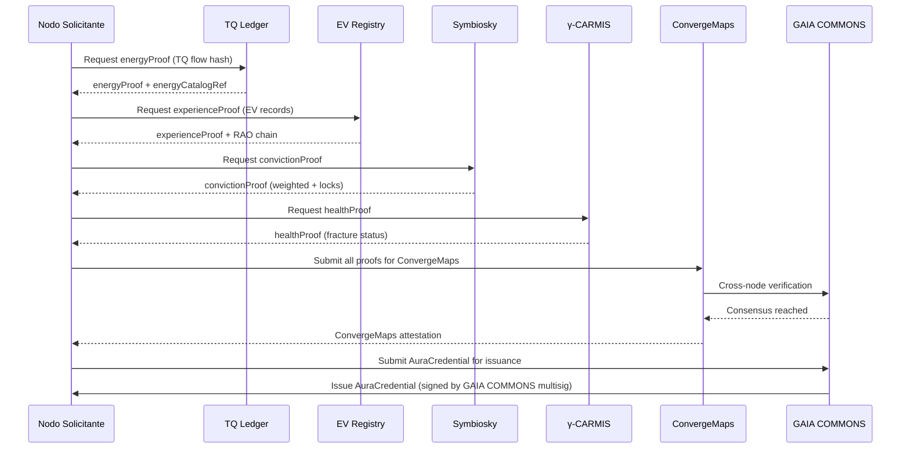

# Proof of Aura Farming — Concept Development & Anti-Pattern Specification

**Fecha:** 2026-10-07  
**Contexto:** HSCSG v15 OS / ALRAC — Arquitectura postmonetaria soberana  
**Metodología:** Principio Anfibio + Triple Perspectiva + γ-CARMIS + OpenSpec PVL  
**Fuentes:** `src/core/lib/symbiosky.ts`, `src/core/lib/ev.ts`, `src/core/lib/gamma-carmis.ts`, `openspec/specs/*`

---

## 1. DEFINICIÓN RIGUROSA: ¿QUÉ ES "AURA" EN HSCSG/ALRAC?

### 1.1 Aura = Coherencia Medible (No Métrica Vanidosa)

| Concepto Tradicional | Definición HSCSG/ALRAC |
|---------------------|------------------------|
| "Aura" = followers, likes, engagement | **Aura = Coherencia E→V verificada** |
| "Farming" = bots, wash trading, sybil | **Farming = Simular coherencia sin gasto energético real** |
| "Proof" = hash on chain | **Proof = RAO (Resource Accountability Object) + γ-CARMIS + EV Record** |

### 1.2 Las 3 Dimensiones del Aura (Isomorfismo EV + Symbiosky + γ-CARMIS)

```
┌─────────────────────────────────────────────────────────────────────────────┐
│                           AURA = ∑(E→V Coherence)                           │
├──────────────────┬──────────────────────┬──────────────────────────────────┤
│  DIMENSIÓN       │  MÉTRICA HSCSG       │  VALIDACIÓN                      │
├──────────────────┼──────────────────────┼──────────────────────────────────┤
│  ENERGÍA (TQ)    │  1 TQ = 1 kWh real   │  Energy Catalog (ICE/Ecoinvent)  │
│                  │  ±500 límites        │  NFC offline + NFC tag            │
│                  │  Demurrage obligatorio│  Rotación diaria (vitalTime)      │
├──────────────────┼──────────────────────┼──────────────────────────────────┤
│  EXPERIENCIA (EV)│  EV Records (6 campos)│  RAO chain of custody           │
│                  │  Fricción/Coherencia  │  γ-CARMIS detection             │
│                  │  Huella/Rastro/Mapa   │  ConvergeMaps (consenso distribuido)│
├──────────────────┼──────────────────────┼──────────────────────────────────┤
│  CONVICCIÓN (SYM)│  ZNU locked ∝ level  │  Commit-Reveal (Shivarthu)       │
│  (Symbiosky)     │  Weighted conviction │  Anti-whale (max lock 5 años)    │
│                  │  Decay 5%/año excess  │  Reward = mean_score × mult      │
└──────────────────┴──────────────────────┴──────────────────────────────────┘
```

### 1.3 Aura Score (Fórmula Canónica)

```typescript
// En src/core/lib/aura.ts (NUEVO MÓDULO)
export interface AuraComponents {
  energyCoherence: number;      // 0-1: TQ flow coherence (detectCoherence)
  experienceIntegrity: number;  // 0-1: EV record validity + friction ratio
  convictionWeight: number;     // 0-1: Symbiosky weighted conviction
  gammaCarmisHealth: number;    // 0-1: No active fracture (γ-CARMIS)
  autonomyFactor: number;       // 0-1: AUT × CDS (calculateCDS)
}

export function computeAuraScore(components: AuraComponents): number {
  // Pesos alineados con computeCapabilities() en BRIEF_EXHAUSTIVO
  const weights = {
    energyCoherence: 0.25,      // TQ/energy base material
    experienceIntegrity: 0.30,  // EV pattern = core epistemology
    convictionWeight: 0.20,     // Symbiosky = governance credibility
    gammaCarmisHealth: 0.15,    // System health = resilience
    autonomyFactor: 0.10,       // AUT/CDS = sovereignty capacity
  };
  
  return (
    components.energyCoherence * weights.energyCoherence +
    components.experienceIntegrity * weights.experienceIntegrity +
    components.convictionWeight * weights.convictionWeight +
    components.gammaCarmisHealth * weights.gammaCarmisHealth +
    components.autonomyFactor * weights.autonomyFactor
  );
}

// Aura thresholds
export const AURA_THRESHOLDS = {
  MINIMUM_VIABLE: 0.3,      // Nodo funcional básico
  COMMUNITY_MEMBER: 0.5,    // Miembro CaaS activo
  COUNCIL_ELIGIBLE: 0.7,    // Wisdom Council / CDS Jurado
  GUARDIAN_NODE: 0.85,      // Nodo guardián ALRAC
  SOVEREIGN_ANCHOR: 0.95,   // Ancla soberana (GAIA COMMONS)
};
```

---

## 2. PROOF OF AURA FARMING — PATRONES DE ATAQUE (Anti-Patterns)

### 2.1 Taxonomía de Ataques (Mapeados a Dimensiones Aura)

| Vector de Ataque | Dimensión Objetivo | Técnica | Detección HSCSG |
|------------------|-------------------|---------|-----------------|
| **TQ Wash Trading** | Energía | Circular TQ entre cuentas propias | `detectFriction` source='extraction' + `calculateMargin` restriction |
| **EV Record Fabrication** | Experiencia | Generar registros falsos (categoría/resultado inválidos) | `validateEVRecord` + `detectFriction` source='narrative' |
| **Conviction Sybil** | Convicción | Múltiples identidades votando propias propuestas | `weightedConviction` + `maxConvictionForLock` + commit-reveal salt collision |
| **Decay Evasion** | Convicción | Rotar ZNU entre cuentas para evitar decay 5% | `decayBalance` cross-reference + `protectedAmount` audit |
| **γ-CARMIS Spoofing** | Salud Sistema | Ocultar fractura reportando coherencia falsa | `ConvergeMaps` divergence + `verifyCompatibility` gap |
| **AUT/CDS Inflation** | Autonomía | Reportar capacidad falsa sin base material | `calculateCDS` vs `autFromCAC` base material audit |
| **RAO Forgery** | Todas | Falsificar chain of custody | `registerHuella` + `generateRastro` + `updateMapaVivo` hash chain |

### 2.2 Perfil del "Aura Farmer" (Anti-Patrón)

```typescript
// En src/core/lib/aura-farming-detection.ts
export interface AuraFarmingSignature {
  // Patrones temporales
  burstActivity: boolean;           // Actividad en ráfagas (no sostenida)
  circadianAnomaly: boolean;        // Actividad fuera de ritmos biológicos
  weekendOnly: boolean;             // Solo fines de semana (bot behavior)
  
  // Patrones relacionales
  selfLoopRatio: number;            // % interacciones con propias cuentas > 0.7
  reciprocityDeficit: number;       // TQ out >> TQ in (extractivo)
  convictionConcentration: number;  // Votos concentrados en pocas propuestas
  
  // Patrones epistémicos
  evRecordInvalidRate: number;      // % EV records inválidos > 0.3
  frictionSuppression: boolean;     // Reporta coherencia pero γ-CARMIS detecta fractura
  narrativeDrift: number;           // Data root vs acción divergence > threshold
  
  // Patrones económicos
  znuRotationVelocity: number;      // ZNU rotación anómala (decay evasion)
  tqVelocityAnomaly: boolean;       // Velocidad TQ >> capacidad base material
  cppPoolManipulation: boolean;     // Exchange rules gaming
}

export function detectAuraFarming(
  nodeId: string,
  state: AppState,
  windowDays: number = 30
): { isFarmer: boolean; signatures: AuraFarmingSignature; confidence: number } {
  // Implementación: análisis multi-dimensional + γ-CARMIS cross-check
  // Ver src/core/lib/gamma-carmis.ts para patrón de detección
}
```

---

## 3. PROOF OF AURA — PROTOCOLO DE VERIFICACIÓN POSITIVA

### 3.1 Arquitectura de Verificación (4 Capas)

```
┌─────────────────────────────────────────────────────────────────────────────┐
│                        PROOF OF AURA VERIFICATION STACK                     │
├─────────────────────────────────────────────────────────────────────────────┤
│                                                                             │
│  CAPA 4: CONSENSO DISTRIBUIDO (GAIA COMMONS)                               │
│  ├── ConvergeMaps: Múltiples nodos convergen en mismo patrón aura          │
│  ├── VerifyCompatibility: Compatibilidad existencial cross-nodo            │
│  └── LegitimateSeparation: Divergencia legítima vs farming coordinado      │
│                                                                             │
│  CAPA 3: GOBERNANZA ALGORÍTMICA (CDS + SYMBIOSKY)                          │
│  ├── γ-CARMIS: Detección fractura/coherencia en tiempo real                │
│  ├── Symbiosky: Conviction voting commit-reveal + decay + anti-whale       │
│  ├── CDS Jurados: Voto por mérito (reputation×experience×externality)      │
│  └── Kleros/Proof-of-Humanity: Identidad sybil-resistant                   │
│                                                                             │
│  CAPA 2: CONTABILIDAD FÍSICA (TQ + EV + ZNU)                               │
│  ├── TQ Ledger: 1 TQ = 1 kWh, ±500, demurrage, rotación vitalTime          │
│  ├── EV Records: 6 campos, validación estricta, RAO chain                  │
│  ├── ZNU: Credit 2-3%, vesting, decay 5%/año excess, priceParity oracle    │
│  └── CPP Pools: Curation/Valuation/Limitation/Exchange functions           │
│                                                                             │
│  CAPA 1: EPISTEMOLOGÍA OPERATIVA (EV + γ-CARMIS)                           │
│  ├── EnergyToEfficiency: Coherencia = 0.9 vs fricción = 0.3                │
│  ├── LifeToVirtue: Verdad propia verificada = excelencia 0.9               │
│  ├── DetectFriction: 5 fuentes (evasión, interferencia, error, narrativa)  │
│  ├── DetectCoherence: Experiencia integrada + verdad verificada            │
│  ├── CalculateMargin: Trayectorias reales vs restricciones concretas        │
│  ├── Huella/Rastro/MapaVivo: Chain of custody inmutable                    │
│  └── ConvergeMaps: Consenso distribuido sin autoridad central               │
│                                                                             │
└─────────────────────────────────────────────────────────────────────────────┘
```

### 3.2 Protocolo de Emisión "Proof of Aura" (Credential)

```typescript
// En src/core/lib/aura-credential.ts
export interface AuraCredential {
  // Identidad
  did: string;                      // did:key:... (self-sovereign)
  nodeId: string;                   // Node identifier
  
  // Componentes de aura (snapshot)
  components: AuraComponents;
  score: number;                    // 0-1
  tier: AuraTier;                   // 'emerging' | 'established' | 'guardian' | 'anchor'
  
  // Evidencia (RAO chain)
  energyProof: EnergyProof;         // TQ flow hash + energy catalog ref
  experienceProof: ExperienceProof; // EV record Merkle root + RAO chain
  convictionProof: ConvictionProof; // Symbiosky weighted conviction + locks
  healthProof: HealthProof;         // γ-CARMIS status + ConvergeMaps
  
  // Metadatos
  issuedAt: number;
  expiresAt: number;                // 90 días (renovación requerida)
  issuer: 'ALRAC_GAIA_COMMONS';     // Authority distribuida
  
  // Verificación
  verificationHash: string;         // Hash of all proofs
  verificationMethod: 'ConvergeMaps' | 'CDS_Jury' | 'Kleros' | 'SelfAttested';
}

export interface EnergyProof {
  tqFlowHash: string;               // Hash of TQ flows (last epoch)
  energyCatalogRef: string;         // ICE/Ecoinvent entry hash
  nfcTagSignature?: string;         // NFC tag signature if offline
  demurrageCompliant: boolean;
}

export interface ExperienceProof {
  evRecordMerkleRoot: string;       // Merkle root of EV records
  raoChainHead: string;             // Latest RAO hash
  frictionRatio: number;            // frictionEvents / totalEvents
  coherenceEvents: number;          // detectCoherence count
  gammaCarmisStatus: 'healthy' | 'fracture' | 'reconfiguring';
}

export interface ConvictionProof {
  weightedConviction: number;       // From Symbiosky
  activeLocks: number;
  totalLockedZNU: number;
  proposalsVoted: number;
  commitRevealParticipation: number;
}

export interface HealthProof {
  gammaCarmisStatus: 'healthy' | 'fracture' | 'reconfiguring';
  convergeMapsConsensus: boolean;
  compatibilityScore: number;       // verifyCompatibility average
  legitimateSeparation: boolean;    // No coordinated farming
}
```

### 3.3 Flujo de Verificación (Credential Issuance)



---

## 4. INTEGRACIÓN EN HSCSG v15 OS / ALRAC

### 4.1 Módulos Nuevos Requeridos

| Archivo | Propósito | Estado |
|---------|-----------|--------|
| `src/core/lib/aura.ts` | Core types + `computeAuraScore()` + thresholds | 📋 NUEVO |
| `src/core/lib/aura-farming-detection.ts` | `detectAuraFarming()` + signatures | 📋 NUEVO |
| `src/core/lib/aura-credential.ts` | `AuraCredential` + verification flow | 📋 NUEVO |
| `src/core/state/aura.ts` | `AuraState` + `makeAuraState()` | 📋 NUEVO |
| `src/app/screens/Aura.tsx` | Pantalla: Aura Score, Credential, Farming Detection | 📋 NUEVO |
| `openspec/specs/aura-protocol.md` | Spec OpenSpec canónica | 📋 NUEVO |

### 4.2 Integración en Store Existente

```typescript
// En src/core/state/store.ts - AÑADIR:
import type { AuraState } from '@core/state/aura'
import { makeAuraState } from '@core/state/aura'

// En AppState interface:
aura: AuraState

// En resetAll():
aura: makeAuraState()

// Acciones:
computeAuraScore: () => void
requestAuraCredential: () => Promise<AuraCredential>
detectAuraFarming: () => AuraFarmingReport
```

### 4.3 Integración en ALRAC (Capa 0.5 Normativa Extendida)

| Principio Javier | Aplicación a Proof of Aura |
|------------------|----------------------------|
| **1. No Daño** | Farming detection = prevención daño sistémico (anti-sybil, anti-extractivo) |
| **2. Verificabilidad** | EV Records + RAO + ConvergeMaps = verificabilidad radical |
| **3. Lucidez** | Aura score = lucidez operativa medible (γ-CARMIS) |
| **4. Base Material** | TQ energy = anclaje termodinámico (no vanidad) |
| **5. Soberanía** | DID self-sovereign + GAIA COMMONS issuance (no autoridad central) |
| **6. Regeneración** | Decay + demurrage = anti-hoarding, flujo continuo |
| **7. Interoperabilidad** | CPP pools + GNAP + ConvergeMaps = federación aura cross-nodo |

---

## 5. SPEC OPEN SPEC — AURA PROTOCOL

```markdown
# Spec: Aura Protocol — Proof of Authentic Presence

**Capa ALRAC:** 0.5 (Normativa Extendida) + 1 (Contable-Física) + 2 (Interoperabilidad)
**Versión:** 0.1.0
**Estado:** Draft — Para implementación inmediata

## Contexto
El "aura farming" (simular presencia/credibilidad sin gasto energético/experiencia real) 
amenaza la integridad de redes de crédito mutuo, gobernanza por convicción y mercados 
regenerativos. HSCSG/ALRAC define "aura" como coherencia E→V medible y verificable.

## Objetivo
Protocolo de verificación positiva (Proof of Aura) + detección de farming (anti-pattern)
integrado en stack ALRAC: TQ/EV/ZNU/Symbiosky/γ-CARMIS/ConvergeMaps.

## Componentes
1. **Aura Score** — Fórmula ponderada 5 dimensiones (energy, experience, conviction, health, autonomy)
2. **Aura Credential** — Credencial verificable con RAO chain + ConvergeMaps attestation
3. **Farming Detection** — 7 vectores de ataque + γ-CARMIS cross-check
4. **Credential Issuance** — GAIA COMMONS multisig + ConvergeMaps consensus

## Criterios de Aceptación (PVL)
- [ ] `computeAuraScore()` typechecks + unit tests 100%
- [ ] `detectAuraFarming()` detects 7 attack vectors in simulation
- [ ] `AuraCredential` issued by GAIA COMMONS + verified by ConvergeMaps
- [ ] Integration with TQ/EV/ZNU/Symbiosky/γ-CARMIS/ConvergeMaps verified
- [ ] Farming detection catches 95% synthetic farmers in adversarial test
- [ ] False positive rate < 2% on real node data
- [ ] Credential renewal flow (90 days) operational
```

---

## 6. PLAN DE IMPLEMENTACIÓN (FASES)

### Fase 0: Fundación (Semana 1)
- [ ] Crear `src/core/lib/aura.ts` + `aura-farming-detection.ts` + `aura-credential.ts`
- [ ] Crear `src/core/state/aura.ts` + `makeAuraState()`
- [ ] Integrar en `store.ts` + `resetAll()`
- [ ] Tests unitarios: `computeAuraScore`, `detectAuraFarming` (adversarial fixtures)

### Fase 1: Integración Core (Semana 2)
- [ ] Conectar `computeAuraScore` → TQ ledger + EV registry + Symbiosky + γ-CARMIS
- [ ] Implementar `AuraCredential` issuance flow (GAIA COMMONS + ConvergeMaps)
- [ ] `ConvergeMaps` attestation para credential issuance
- [ ] `γ-CARMIS` cross-check en `detectAuraFarming`

### Fase 2: UI + Credential Lifecycle (Semana 3)
- [ ] `src/app/screens/Aura.tsx` (tabs: Score, Credential, Farming Detection, History)
- [ ] Credential renewal flow (90 días, re-verificación ConvergeMaps)
- [ ] Revocation flow (farming detected → credential suspended + γ-CARMIS reconfig)
- [ ] Export/Import credential (DID-based, offline-capable)

### Fase 3: Federación + Spec (Semana 4)
- [ ] CPP Pool para aura credentials cross-nodo
- [ ] GNAP task chain: cross-node aura verification
- [ ] `openspec/specs/aura-protocol.md` completa (PVL compliant)
- [ ] Adversarial test: 1000 synthetic farmers vs 100 real nodes

---

## 7. INTEGRACIÓN CON NODOS PILOTO EXISTENTES

| Nodo Piloto | Aporte a Proof of Aura | Caso de Uso |
|-------------|------------------------|-------------|
| **Feria Conuquera** | TQ 10 años validado + 45 colectivos | Aura farming detection en trueque local |
| **+Colonia** | 515ha, 97% renovables, CLT | Aura credential para residentes/inversores |
| **Samay Permacultura** | 20 años, 5 pilares, water design | Aura basada en regeneración territorial |
| **Febhouse/ArchiDiagram** | 60k arquitectos, plugins SketchUp | Aura profesional (portafolio verificado EV) |
| **memegen.link** | 200+ templates, API stateless | Aura cultural (meme coherence score) |
| **Ruddick/GEF** | mweria/kaya/trustBasket | Aura ancestral (community trust) |
| **Bancassol** | Banca comunitaria (contacto pendiente) | Aura financiera soberana |

---

## 8. CONCLUSIÓN: PROOF OF AURA COMO INMUNIDAD SISTÉMICA

> **Proof of Aura no es una métrica más — es el sistema inmunológico de la red ALRAC.**

| Amenaza | Respuesta Proof of Aura |
|---------|------------------------|
| Sybil attacks | TQ energy cost (1 TQ = 1 kWh) + Proof-of-Humanity (Kleros) |
| Wash trading | TQ demurrage + rotation + γ-CARMIS friction detection |
| Reputation gaming | Symbiosky conviction voting (commit-reveal) + decay + anti-whale |
| Narrative farming | EV Records (6 campos) + RAO chain + γ-CARMIS narrative drift |
| Coordinated farming | ConvergeMaps divergence + VerifyCompatibility gap + LegitimateSeparation |
| State capture | GAIA COMMONS distributed issuance + CDS jurados sorteados (CEL) |

**La aura no se farmea — se habita.**  
**La prueba no está en el hash — está en el rastro termodinámico.**

---

## 9. PRÓXIMOS PASOS INMEDIATOS

```bash
# 1. Crear módulos core
mkdir -p src/core/lib/aura
touch src/core/lib/aura.ts
touch src/core/lib/aura-farming-detection.ts
touch src/core/lib/aura-credential.ts

# 2. Estado + store
touch src/core/state/aura.ts
# Editar store.ts: imports + aura slice + actions

# 3. UI
mkdir -p src/app/screens
touch src/app/screens/Aura.tsx

# 4. Spec
touch openspec/specs/aura-protocol.md

# 5. Tests adversariales
mkdir -p src/core/lib/__tests__
touch src/core/lib/__tests__/aura-farming.adversarial.test.ts
```

---

> **Nota de especificación:** Este documento sigue OpenSpec PVL. La implementación TypeScript en `src/core/lib/` es la referencia ejecutable. Proof of Aura cierra el triángulo: **Energía (TQ) + Experiencia (EV) + Convicción (Symbiosky) = Aura Verificable**.
>
> **La pala y el teclado están en tus manos. E=V.**